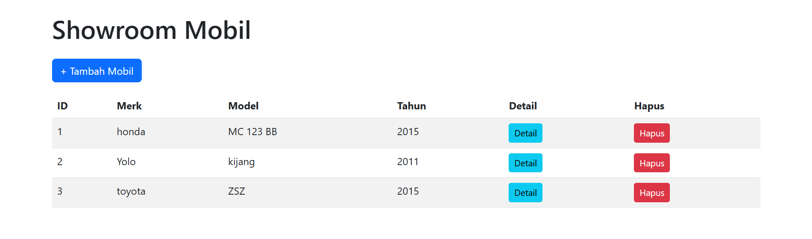
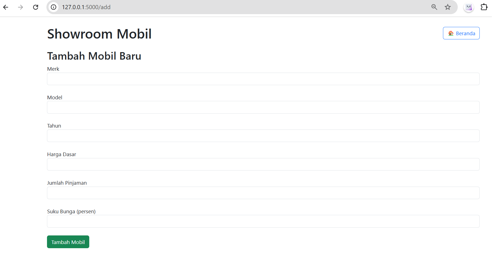
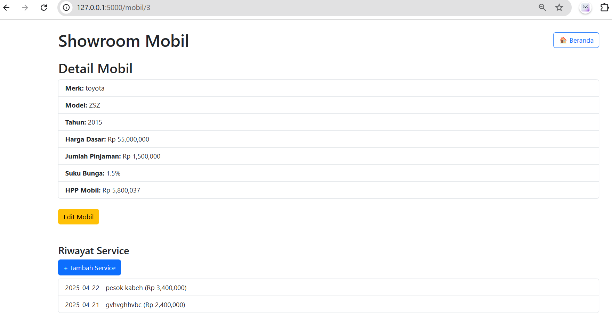

# SHOWROOM CAR
Menggunakan pyhton dengan framework flask dan database sqlite

# 1. install requirements.txt
pip install -r requirements.txt

# 2. buka app.py
python app.py

# 3. Buka browser
Aplikasi akan berjalan pada server http://127.0.0.1:5000

# FOTO
1. 
2. 
3. 
